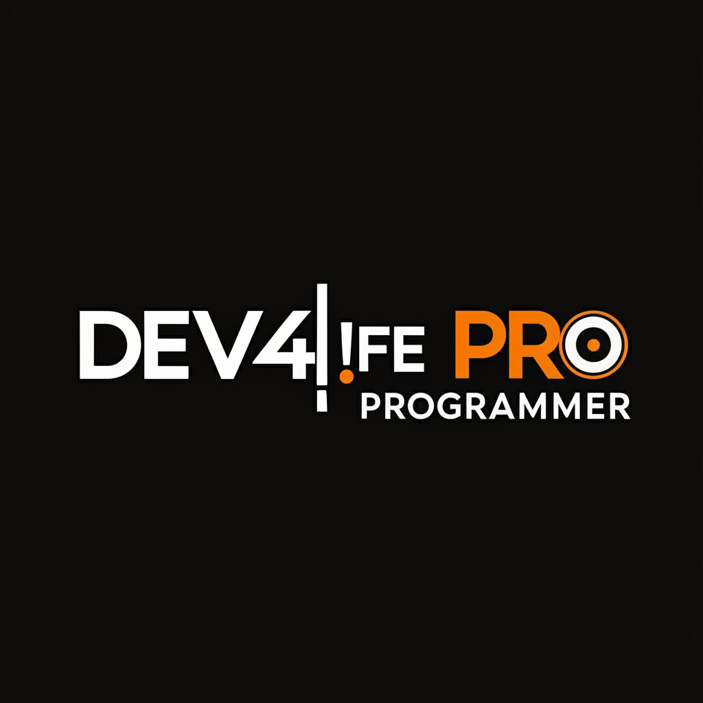

# 👋 Hey there, I'm **Pasindu Madhuwantha**

   
  

  

  <em>Learning to build intelligent, efficient, and scalable software systems.</em>

---

## 🌱 About Me

> 🧠 **Software Engineer in Training | Passionate about Server-Side Logic, Architecture & Scalability**

I’m on a journey to become a **skilled Software Engineer** with a strong focus on **backend and system-level development**.  
My learning revolves around building efficient, maintainable systems using **modern tools, clean code principles, and scalable design**.

### 🎯 **What Drives Me**
- ⚙️ Crafting logical, server-side architectures that scale  
- 🧩 Designing modular, data-driven systems  
- ☁️ Exploring cloud-native development and DevOps workflows  
- 💡 Continuously learning through real-world projects and experimentation  

### 📚 **Currently Learning**
- 🖥️ **Programming:** Java, JavaScript  
- 🧩 **Frameworks:** Spring Boot, Node.js  
- 🏗️ **Architecture:** REST APIs, Microservices, MVC Pattern  
- 🛠️ **DevOps:** Docker, CI/CD Basics  

---

## ⚡ Tech Stack & Tools

| **Area** | **Technologies / Tools** |
|-----------|--------------------------|
| 💻 **Languages** | Java, JavaScript |
| ⚙️ **Frameworks** | Node.js |
| 🗄️ **Database** | MySQL |
| 🧰 **Tools** | IntelliJ IDEA, VS Code, Git, GitHub |

---

## 📊 GitHub Insights

---

## 🎓 Learning Journey

### 🏫 **Institute of Computer Engineering Technology (iCET)**
🎓 *Full-Stack Development Program (iCD)*  
*Focused on Software Engineering principles & server-side development*

### 🧭 **Core Focus Areas**
| 🧩 Topic | 📘 Description |
|-----------|----------------|
| **Server-Side Programming** | Java, REST APIs, Business Logic |
| **Database Design** | MySQL, Query Optimization |
| **Software Architecture** | System Design, Microservices |
| **Clean Code Principles** | Readability, Maintainability, Reusability |

---

## 🌐 Connect With Me

  
  
  
  

---

## 💬 Collaboration & Goals

🤝 **Open to:** Collaborative learning, student projects, open-source contributions  
🎯 **Current Focus:** Strengthening backend logic, mastering system architecture, exploring automation  
🚀 **Goal:** Grow into a Software Engineer who builds reliable, scalable, and impactful systems  

---

### 🎮 Contribution Game

<picture>
  <source media="(prefers-color-scheme: dark)" srcset="https://raw.githubusercontent.com/PasinduOG/PasinduOG/output/pacman-contribution-graph-dark.svg">
  <source media="(prefers-color-scheme: light)" srcset="https://raw.githubusercontent.com/PasinduOG/PasinduOG/output/pacman-contribution-graph.svg">
  
</picture>

---

  
### 💭 *"Every line of code is a step closer to mastery."* ✨

**Thanks for visiting my profile! Let's build something amazing together! 🚀**

⭐ **If you like my journey, star my repositories and connect!** ⭐

